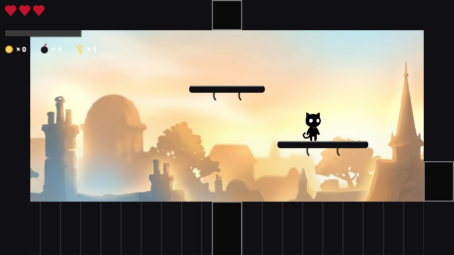
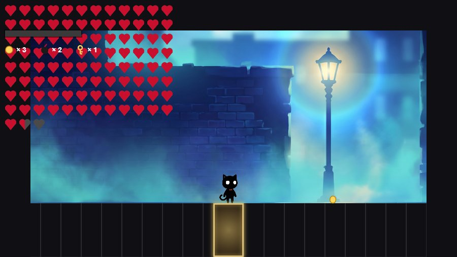

# 黑貓流浪記 Black Cat Roguelike

LIMBO × BADLAND 視覺風格的 2D 橫向 Roguelike——黑貓剪影在發光的彩色世界裡吐毛球、跳平台、炸隱藏房，一路打穿七層樓。純前端（Canvas + ES Module），無任何建置工具與依賴。

## 🎮 立即遊玩

**<https://cynthianomail-gif.github.io/Blackcat_roguelike/>**（需鍵盤；首次載入含 BGM 約 70MB）




## 操作

| 鍵 | 動作 |
|---|---|
| A / D（←→） | 移動 |
| W / Space（↑） | 跳躍 |
| S（↓） | 趴下；平台上按住 S＋W＝下穿；站在地板開口上按住＝下樓 |
| J（按住） | 吐毛球 |
| L | EX 必殺（能量滿時） |
| Shift | 衝刺（無敵幀） |
| B | 放置炸彈（範圍傷害／炸開隱藏房的牆） |
| E | 使用主動道具／購買 |
| Tab | 樓層地圖 |
| M | 靜音 |
| Esc | 暫停 |

## 特色

- **7 層程序生成樓層**：每層 7–13 房（道具房／商店／挑戰房／魔鬼房／天使房／隱藏房），13 隻 Boss 按層抽選
- **100 種道具＋10 組 Synergy**：射擊改造、跟班、蓄力、雷射、彈跳、回力標……組合觸發隱藏連動
- **單向跳台**：階梯通往天花板門、站高打空中怪；趴下閃彈幕
- **隱藏房**：每層 60% 機率生成，把炸彈放在正確的牆邊炸開（X 光眼鏡道具可直接顯示位置）
- **BADLAND 式美術**：發光彩色背景 × 純黑前景剪影（黑色＝可互動）；素材由 AI 生成管線產出
- **8 首 Suno BGM**＋22 種 Web Audio 合成音效

## 本地執行

任何靜態伺服器皆可（ES Module 需要 http，不能直接開檔案）：

```
npx serve .        # 或 python -m http.server、VS Code Live Server…
```

開發／交接細節見 [HANDOFF.md](HANDOFF.md)；規格文件（企畫書／技術規格書／音訊規格書）在 repo 根目錄。

---
🐈‍⬛ Built with [Claude Code](https://claude.com/claude-code)
